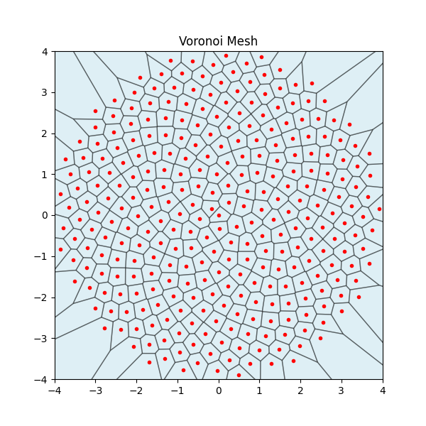

Core Concepts
=============

Dimensionality
--------------

Yggdrasil is designed from the start to be extensible to multiple spatial dimensions. This is accomplished by templating
most classes on integer dimensionality. For example, 

.. code-block:: c++
    
    template <int dim>
    class Kinetics : public Physics<dim> {}

defines a derived class ``Kinetics`` that operates in 1, 2, or 3 spaital dimensions. When templated classes are Python wrapped in Yggdrasil,
they typically specify dimensionality in their instantiated name, *e.g.* ``Kinetics2d``.

Units and Constants
-------------------

Yggdrasil is unit agnostic. That is to say, the code does not *prescribe* any particular units for you. However, 
for most problems, you will want to define your units in order for certain universal constants like *G* to have their 
correct values. This is done via the ``PhysicalConstants`` object which has two constructor methods. You can either supply 
the full scope of your desired units with unit length (in meters), unit mass (in kg), 
unit time (in seconds), unit temperature (in Kelvin), and unit charge (in Coulomb), or just a subset of the first three, 
whereupon temperature will be assumed to be Kelvins and charge will be assumed to be Coulombs. 

For example, in order to simulate something like the Earth with state quantities near 1, you may choose to instantiate your units like so:

.. code-block:: python

    myUnits = PhysicalConstants(6.387e6, 5.97e24, 1.0)

From these units, Yggdrasil will calculate at the time of the constructor new values for all of the universal constants 
to use in your chosen physics packages.

Yggdrasil also comes with some helper methods for a handful of frequently used unit systems in 
``Units.py``, like ``MKS()``, ``CGS()``, and ``SOL()``. 
Simply invoke them with ``myUnits = MKS()`` if you've imported the ``Units`` module.

.. note::
    The ``PhysicalConstants`` object is typically passed to a physics package via the constructor for that package. Not all physics packages
    require a ``PhysicalConstants`` object.

Fields and Nodelists
--------------------
Fields are essentially decorated std::vectors that come with some additional functionality that make them 
assignable to various physics packages by name, *e.g.* ``density`` may be a Field that certain physics classes create and evolve
as part of the state. This way, if multiple physics packages use the same Field names, they will be able to operate on the same data in
an operator split mode.

.. note::
    Yggdrasil does not currently support the use of multiple Field objects with the same internal name. If you try to assign two Fields 
    with the same name to a ``Nodelist``, Yggdrasil will raise an error.

Yggdrasil's primary container for state data is the ``Nodelist`` class. Fields are assigned to a ``Nodelist`` for containerization
of data, for pairing of different Field data into a state, and for state copying. Most physics packages will expect a ``Nodelist`` 
to be passed as a constructor argument to keep track of
which state vectors the physics package is intended to evolve. 

.. note::
    Yggdrasil does not assume any specific Fields (except ``id``) are necessary without a physics package first 
    creating that Field and then assigning it to the ``Nodelist``. If you try to access a Field called ``density`` inside
    a problem without any physics classes that use ``density``, Yggdrasil will raise an error, unless you have manually created that Field yourself
    within your problem script.

Generators
-----------
Generators create point distributions for use in particle-based simulations or Voronoi mesh generation. Generators return a python list of points
in 2d or 3d coordinates inside a unitary bounding box or unit circle/sphere for a chosen number of points. The available generators are:

.. code-block:: text

    ConstantDThetaDisk2d
    FibonacciDisk2d
    FibonacciSurface3d
    GlassNodeGenerator2d/3d
    GlassNodeGenerator3d
    PoissonDisk2d
    RandomNodeGenerator1d/2d/3d
    RecursivePrimitiveRefinementSurface3d
    ParameterizedSpiralSurface3d
    RPRPSNodeGenerator3d
    SEAGenSurface3d

Below is an example generated distribution of points using the ``FibbonaciDisk2d`` generator used as
seed generators for a Voronoi mesh.

.. note::
    Because all of Yggdrasil's generators return points inside a unitary bounding box or unit circle/sphere,
    you'll likely want to scale, move, and cull them to fit your particular problem. See the nodeGenerator tests
    inside the ``tests`` directory for examples.

Physics Packages
--------------------
Physics packages are the primary computational engines of Yggdrasil. With a few exceptions,
all physics packages consume a ``NodeList`` and a ``constants`` object at constructor time.
Hydrodynamics physics packages also require an equation of state (``eos``). Physics packages
hold onto State vectors of pertinent Fields and prescribe how their derivatives are to be
calculated. However, physics packages do not themselves advance the state - the Integrators do.

The current list of available physics packages and their constructors is

.. code-block:: text

    ConstantGravityXd(nodeList,constants,gravityVector)
    EulerHydroXd(nodeList,constants,eos,grid)
    FEMXd(nodeList,constants,mesh)
    GridHydroHLLXd(nodeList,constants,eos,grid)
    KineticsXd(nodeList,constants)
    NBodyGravityXd(nodeList,constants,plummerLength)
    PointSourceGravityXd(nodeList,constants,pointSourceLocation,pointSourceVelocity,pointSourceMass)
    RockPaperScissors(grid,A,D)
    WaveEquationXd(nodeList,constants,grid,C)
    WaveEquationXd(nodeList,constants,grid,depthMap)

For each of these, replace the ``Xd`` with your desired dimensionality (1d,2d,3d). Consult the
python class definitions in the ``src/Physics`` directory for specific implementation details.

Assigning multiple physics packages to
the integrator is as simple as passing a Python list of constructed physics objects to the integrator's constructor. 
The order in which you assign these physics objects to 
the integrator is the order in which they will be computed (operator splitting). For example,
suppose I've created a ``Godzilla`` physics object and separately a ``KingKong`` physics object, and I want my RK4 integrator to 
evolve them in that order, I'd construct the RK4 integrator as ``RungeKutta4Integrator2d(packages=[Godzilla,KingKong],dtmin=0.01)``,
or something to that effect.

Equations of State
--------------------
If a particular physics package requires an equation of state (EOS), you'll need to pass it in as the ``eos`` argument. For example, suppose
I want to use an Ideal Gas EOS for my hydro physics object. I simply create the EOS with ``eos = IdealGasEOS(5.0/3.0,constants)`` 
and pass it to my hydro physics object as the ``eos`` argument: 
``hydro = GridHydroHLL2d(myNodeList,constants,eos,myGrid)``.

The current list of available equations of state and their constructors is

.. code-block:: text

    IdealGasEOS(specificHeatRatio,constants)
    PolyTropicEOS(polyTropicConstant,polyTropicIndex,constants)
    MieGruneisenEOS(rho0,C0,Gamma0,S,constants)
    TillotsonEOS(constants,**params<from TillotsonMaterials>)
    IsothermalEOS(soundSpeed,constants)

Opacity/Conductivity
--------------------
Opacity and conducitivity are very much an "under development" feature in Yggdrasil. However, the code does currently support
a constant opacity model, and by extension, a conductivity that assumes the radiative limit.

.. math::
    \begin{aligned}
    \chi_{rad} &= \frac{16\sigma_{SB}T^3}{3\kappa\rho}\\
    \end{aligned}

Much like equations of state, this opacity model requires a constants object to compute the Stefan Boltzmann constant.

.. code-block:: text

    ConstantOpacity(double k0,PhysicalConstants& constants)

Currently, only the thermal conduction physics package requires (and can make use of) an opacity model. 

Mesh/Grid Handling
--------------------
Yggdrasil supports two kinds of meshes: Eulerian grids and Element meshes. 

Eulerian Grids
^^^^^^^^^^^^^^
Eulerian grids are invoked with the dimensional ``Grid`` class with 
``myGrid=Grid2d(nx=[int],ny=[int],dx=[float],dy=[float])`` to create a 2D grid with nx cells in the x-direction
and ny cells in the y-direction. The ``dx`` and ``dy`` parameters set the spatial dimensions of a single cell.
Grids in Yggdrasil can be 1D, 2D, or 3D, and the constructor assigns positions to the cells of the grid 
in ascending order in each spatial coordinate. 

.. note::
    Grids also have an optional ``setOrigin(Vector)`` method for moving the
    (0,0) coordinate to any location inside your grid, `i.e.` if you've created a 4x4 grid and the first cell has
    coordinates (0,0), but you'd like the origin to sit at the center of the grid instead, you can do so simply by invoking
    ``myGrid.setOrigin(Vector2d(2,2))`` which will adjust all of the spatial coordinates of your cells to make
    the center of the grid the (0,0) coordinate.

Element Meshes
^^^^^^^^^^^^^^
<wip>

Voronoi Meshes
^^^^^^^^^^^^^^^
Currently, Yggdrasil can construct 2d Voronoi meshes from a ``Field<Vector<2>>`` or a ``FieldofVector2d`` if constructed 
from within Python. Unique topology is not guaranteed.
See the ``voronoi_diag.py`` example for a use-case. 

Boundary Conditions
--------------------
Currently, Yggdrasil has two species of boundary objects: grid boundaries and collider boundaries.
Grid boundaries apply to mesh-based physics and collider boundaries apply to lagrangian particles.

Grid Boundaries
^^^^^^^^^^^^^^^
The types of grid boundaries used in Yggdrasil are:

.. code-block:: text
    
    DirichletGridBoundaries
    OutflowGridBoundaries
    PeriodicGridBoundaries
    ReflectingGridBoundaries 

Each of these is available in any of 1d, 2d, or 3d varieties. Grid boundaries are applied directly
to the grid cells and so must be pointed at the correct grid object at construction.

.. code-block:: python

    box = DirichletGridBoundaries2d(grid=myGrid)

Dirichlet grid boundaries have methods for applying boundaries to cells within the grid such as 
``box.addBox(Vector2d(16,20),Vector2d(20,44))`` which would add Dirichlet conditions to the cells
whose positions span 16-20 in *x* and 20-44 in *y*.
The full list of available methods for ``DirichletGridBoundaries`` is given below.

.. literalinclude:: ../../src/Boundaries/dirichletGridBoundaries.py
    :language: python
    :lines: 8-17

The ``addDomain`` method applies Dirichlet conditions to all of the bounds (left-most,right-most,etc.)
of the mesh. The other grid boundary types merely perform ``addDomain`` at constructor time and do not
have any special methods.

.. warning::
    At this time, Yggdrasil's reflecting, periodic, and outlfow boundaries apply to all of the bounds
    of your mesh, *i.e* the left and right-most cells will be periodic as well as the top and bottom-most
    cells in 2d. 

Collider Boundaries
^^^^^^^^^^^^^^^^^^^
Collider boundaries are spherical (or round in 2d) or box-shaped objects that reflect the motion of 
lagrangian particles across the normal of their surface. A ``SphereCollider`` takes as arguments 
a position Vector for the center of the sphere (or circle), a radius, and an elasticity parameter
between 0 and 1. A value of 1 for this parameter means purely elastic collisions with absolute
momentum conservation. 

.. code-block:: python

    SphereCollider2d(position=Vector2d(x, y), radius=collider_radius, elasticity=0.8)

A ``BoxCollider`` takes as arguments two position Vectors that describe 
opposite corners of the box and an elacsticity parameter. 

.. code-block:: python

    BoxCollider2d(position1=Vector2d(x, y), position2=Vector2d(x+width,y+height), elasticity=0.5)

Collider boundaries can be assigned to lagrangian physics packages with the ``addBoundary()`` method:

.. code-block:: python

    myKineticsPhysicsPkg.addBoundary(myBoxCollider)

Integrators
--------------------
Yggdrasil's integrators all have essentially the same interface: they take as arguments your physics packages
as ``packages=[python list]``, a ``dtmin=[float]`` argument to set the lowest allowable timestep, and a ``verbose=[boolean]`` 
argument that determines whether or not to print to screen which physics package is controlling the timestep. As of |today|, the 
integrators available in Yggdrasil are

.. code-block:: text

    IntegratorXd - a forward Euler integrator
    RungeKutta2IntegratorXd
    RungeKutta4IntegratorXd
    CrankNicolsonIntegratorXd - an implicit time integrator

The Controller
--------------------
The controller object is a Python class that issues instructions to the ingetrator object and performs any extra periodic work. Integration steps
are performed using the ``Step()`` method of the integrator, and the controller is responsible for issuing these steps and halting the simulation
if a ``tstop`` is supplied. The controller is simple enough to be reproduced in its entirety below:

.. literalinclude:: ../../src/Utilities/Controller.py
   :language: python
   