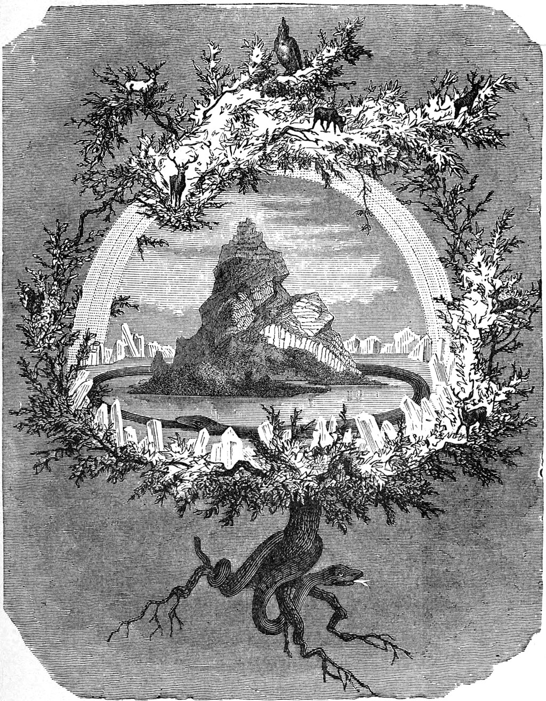

Introduction
============

The Yggdrasil is an immense and sacred tree in Norse mythology that upholds the nine realms of the cosmos. 

Purpose of Yggdrasil
---------------------

Yggdrasil is a generic physics simulation framework. It is designed to be used as a base for varied physics simulation methods 
(FVM,FEM,etc) while keeping helper methods like equations of state and integrators generic enough to be portable between a wide 
variety of methods choices. Yggdrasil's major classes and methods are written in C++ and wrapped in Python using pybind11 to 
enable them to be imported as Python3+ modules inside a runscript. Python holds and passes the pointers to most objects 
inside the code, while the integration step is always handled by compiled C++ code. Any Python class that returns the expected 
data types of the compiled C++ classes can substitute for a precompiled package (e.g. a custom equation of state), though speed will suffer. 

Overview of Capabilities
-------------------------

Yggdrasil's capabilities as of |today| are shown below:

.. csv-table:: Yggdrasil's current capabilities
   :file: capabilities.csv
   :header-rows: 1

Intended Audience
-----------------

Yggdrasil's intended audience is computational scientists who want a toy simulation code to scope simple problems that's easily 
driveable and scriptable with a Python interface, and anyone who doesn't mind getting their hands dirty writing their own physics 
packages in a fully abstracted simulation framework.
