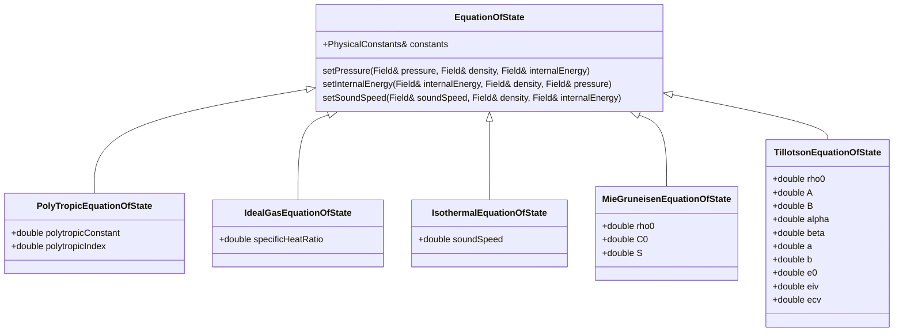

```mermaid
classDiagram
EquationOfState <|-- PolyTropicEquationOfState
EquationOfState <|-- IdealGasEquationOfState
EquationOfState <|-- IsothermalEquationOfState
EquationOfState <|-- MieGruneisenEquationOfState
EquationOfState <|-- TillotsonEquationOfState
EquationOfState : +PhysicalConstants& constants
EquationOfState : setPressure(Field& pressure, Field& density, Field& internalEnergy)
EquationOfState : setInternalEnergy(Field& internalEnergy, Field& density, Field& pressure)
EquationOfState : setSoundSpeed(Field& soundSpeed, Field& density, Field& internalEnergy)
class PolyTropicEquationOfState{
    +double polytropicConstant
    +double polytropicIndex
}
class IdealGasEquationOfState{
    +double specificHeatRatio
}
class IsothermalEquationOfState{
    +double soundSpeed
}
class MieGruneisenEquationOfState{
    +double rho0
    +double C0
    +double S
}
class TillotsonEquationOfState{
    +double rho0
    +double A
    +double B
    +double alpha
    +double beta
    +double a
    +double b
    +double e0
    +double eiv
    +double ecv
}

```